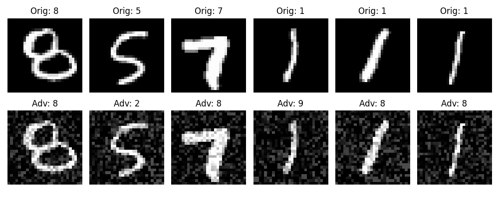
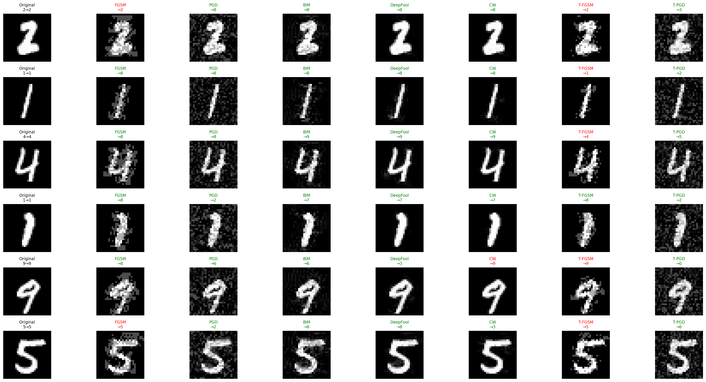
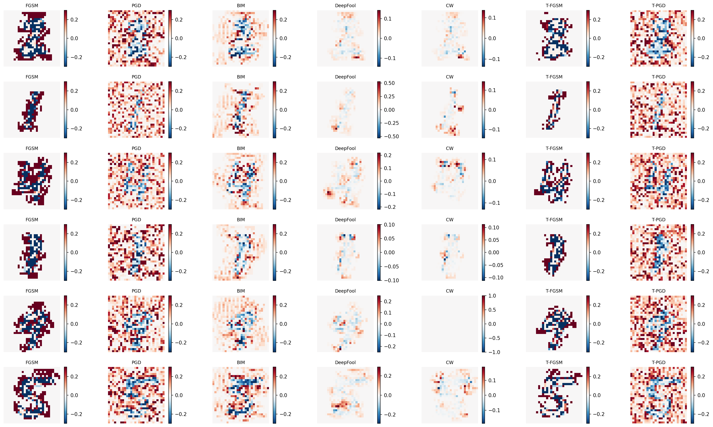

# Attacks Project

A simple and flexible Python library for adversarial attacks on neural networks. Generate adversarial examples with just a few lines of code!

## Features

- **Easy to Use**: Just pass your model, input, and labels - the library handles the rest
- **Multiple Attack Methods**: FGSM, PGD, BIM, DeepFool, and C&W
- **Targeted & Untargeted**: Support for both targeted and untargeted attacks
- **PyTorch Compatible**: Works seamlessly with any PyTorch model
- **Well Documented**: Clear documentation and examples for each attack

## Installation

```bash
# Install from source (Template folder)
git clone https://github.com/Mohammad-Ali-Haider/rift-adv.git
cd rift-adv
uv sync
uv run main.py
```



## Quick Start

```python
import torch
from rift_adv.attacks import FGSM, PGD

# Load your model
model = your_model.eval()

# Prepare your data
images = torch.randn(1, 3, 224, 224)  # Your input images
labels = torch.tensor([5])              # True labels

# Create an attack
attack = FGSM(model, eps=0.3)

# Generate adversarial examples
adv_images = attack(images, labels)

# That's it! The adversarial images are ready
```

## Supported Attacks

### 1. FGSM (Fast Gradient Sign Method)
Fast one-step attack that perturbs images in the direction of the gradient.

```python
from rift_adv.attacks import FGSM

# Untargeted attack
attack = FGSM(model, eps=0.3)  # For MNIST
adv_images = attack(images, labels)

# Targeted attack (make the model predict class 0)
attack = FGSM(model, eps=0.3, targeted=True)
target_labels = torch.tensor([0])
adv_images = attack(images, labels, target_labels)
```

**Note**: For ImageNet/normalized images, use smaller epsilon values like `8/255`.

### 2. PGD (Projected Gradient Descent)
Iterative attack that applies FGSM multiple times with projection.

```python
from rift_adv.attacks import PGD

# Untargeted attack
attack = PGD(model, eps=8/255, alpha=2/255, steps=10)
adv_images = attack(images, labels)

# Targeted attack
attack = PGD(model, eps=8/255, alpha=2/255, steps=40, targeted=True)
adv_images = attack(images, labels, target_labels)
```

### 3. BIM (Basic Iterative Method)
Similar to PGD but with deterministic initialization.

```python
from rift_adv.attacks import BIM

attack = BIM(model, eps=8/255, alpha=1/255, steps=10)
adv_images = attack(images, labels)
```

### 4. DeepFool
Finds minimal perturbations to change classification by linearizing decision boundaries.

```python
from rift_adv.attacks import DeepFool

attack = DeepFool(model, steps=50, overshoot=0.02)
adv_images = attack(images, labels)
```

### 5. C&W (Carlini & Wagner)
Optimization-based attack that finds minimal L2 perturbations.

```python
from rift_adv.attacks import CW

# Untargeted attack
attack = CW(model, c=1.0, steps=1000)
adv_images = attack(images, labels)

# Targeted attack
attack = CW(model, c=1.0, steps=1000, targeted=True)
adv_images = attack(images, labels, target_labels)
```

Demo file (demo.py)
```bash
uv run demo.py
```





## Attack Parameters

### Common Parameters
- `model`: Your PyTorch model (nn.Module)
- `eps`: Maximum perturbation size (for Lp norm attacks)
- `targeted`: Whether to perform a targeted attack (default: False)

### FGSM Parameters
- `eps`: Epsilon (perturbation size), default: 0.007

### PGD Parameters
- `eps`: Epsilon (perturbation size), default: 0.03
- `alpha`: Step size, default: 0.007
- `steps`: Number of iterations, default: 10
- `random_start`: Random initialization, default: True

### BIM Parameters
- `eps`: Epsilon (perturbation size), default: 0.03
- `alpha`: Step size, default: 0.007
- `steps`: Number of iterations, default: 10

### DeepFool Parameters
- `steps`: Maximum iterations, default: 50
- `overshoot`: Overshoot parameter, default: 0.02
- `num_classes`: Number of classes to consider, default: None (all)

### C&W Parameters
- `c`: Confidence parameter, default: 1.0
- `kappa`: Confidence gap, default: 0
- `steps`: Number of optimization steps, default: 1000
- `lr`: Learning rate, default: 0.01

## API Design

All attacks follow the same simple interface:

```python
# 1. Create attack instance
attack = AttackMethod(model, **attack_params)

# 2. Generate adversarial examples
adv_images = attack(images, labels, target_labels=None)
```

### Parameters:
- `images`: Input tensor (batch_size, channels, height, width)
- `labels`: True labels for untargeted attacks
- `target_labels`: Target labels for targeted attacks (optional)

### Returns:
- Adversarial images as a PyTorch tensor

## Requirements

- Python >= 3.11
- PyTorch >= 2.0
- torchvision >= 0.15

## References

1. **FGSM**: Goodfellow et al., "Explaining and Harnessing Adversarial Examples", ICLR 2015
2. **PGD**: Madry et al., "Towards Deep Learning Models Resistant to Adversarial Attacks", ICLR 2018
3. **BIM**: Kurakin et al., "Adversarial examples in the physical world", ICLR 2017 Workshop
4. **DeepFool**: Moosavi-Dezfooli et al., "DeepFool: a simple and accurate method to fool deep neural networks", CVPR 2016
5. **C&W**: Carlini and Wagner, "Towards Evaluating the Robustness of Neural Networks", IEEE S&P 2017

## License

This project is open source and available under the MIT License.

## Contributing

Contributions are welcome! Feel free to open issues or submit pull requests.
